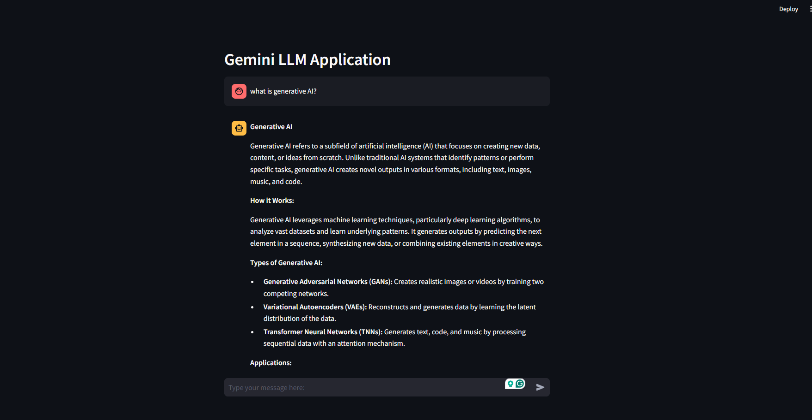

# Gemini LLM Chatbot Demo

This project demonstrates a simple chatbot application built with Streamlit, utilizing the Gemini Pro model from Google Generative AI for natural language understanding and responses. The chatbot can interact with users in real-time, maintaining conversation history within a session.

## Features

- **Streamlit Integration**: Provides an interactive web interface for the chatbot.
- **Google Generative AI**: Utilizes the Gemini Pro model for generating responses.
- **Session Management**: Maintains chat history within the user session.

## Screenshots

### User Input and Response



## Installation

1. **Clone the repository**:

   ```sh
   git clone https://github.com/OussamaBentaouil70/Chat_Bot_Gemini.git
   cd Chat_Bot_Gemini
   ```

2. **Create and activate a virtual environment**:

   ```sh
   python -m venv venv
   source venv/bin/activate   # On Windows, use `venv\Scripts\activate`
   ```

3. **Install the required packages**:

   ```sh
   pip install -r requirements.txt
   ```

4. **Set up environment variables**:
   - Create a `.env` file in the project root directory.
   - Add your Google API key to the `.env` file:
     ```
     GOOGLE_API_KEY=your_google_api_key
     ```

## Usage

1. **Run the Streamlit app**:

   ```sh
   streamlit run app.py
   ```

2. **Interact with the chatbot**:
   - Open the local URL provided by Streamlit (typically `http://localhost:8501`).
   - Type your message in the input box and press Enter.
   - The chatbot will respond, and the conversation will be displayed on the web page.

## Code Overview

### Environment Setup

```python
from dotenv import load_dotenv
load_dotenv()  # Loading all the environment variables
```
